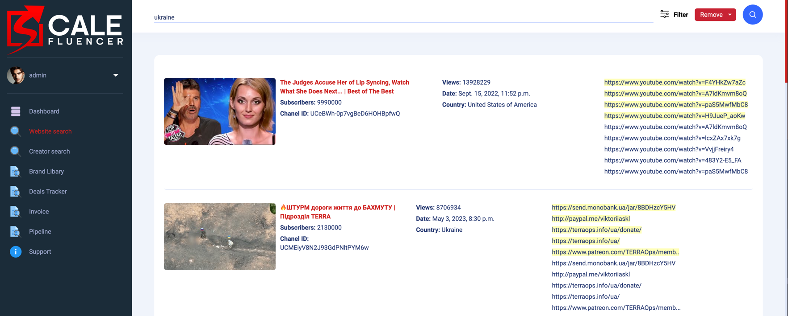

# YouTube Project

The website's functionality is enriched by leveraging state-of-the-art technologies to provide an exceptional user experience. Our platform seamlessly integrates cutting-edge libraries and frameworks, enhancing its capabilities and ensuring unparalleled performance.

With powerful tools like Django, we meticulously analyze video descriptions and comments, employing advanced search filters and asynchronous processing to uncover valuable insights for advertisers. This asynchronous functionality, powered by the asgiref library, enables lightning-fast searches and effortless navigation through vast amounts of data.

Additionally, our platform harnesses the capabilities of the Stripe and PayPal libraries to seamlessly handle payment transactions, offering users a secure and convenient way to upgrade their plans and access premium features.

Furthermore, the integration of JavaScript libraries like Werkzeug and requests enhances the dynamic functionality of our website, facilitating smooth interactions and responsive design across various devices.

In essence, our website is a testament to innovation and sophistication, combining the prowess of industry-leading libraries and frameworks to deliver an unparalleled user experience.




Video Content Analysis: Websites of this type allow for the analysis of YouTube videos using keywords, comments, and other parameters to identify potential advertisers or interesting content topics.

Data Collection: They collect data about users, videos, and comments on YouTube for further use in marketing analytics purposes.

Content Monetization: Entrepreneurs can utilize this data to create engaging and popular video content, as well as to attract advertisers or sponsors.

Marketing Enhancement: Marketers can use this data to improve marketing strategy, identify target audiences, and develop more effective advertising campaigns.


__In summary, these websites enable the analysis of YouTube videos to identify potential advertisers or engaging content topics through data collection and analysis. Entrepreneurs can leverage this information to create popular video content and attract advertisers, while marketers can enhance their strategies and develop more effective advertising campaigns.__

## Getting Started

### 1. Using Git

- Clone the repository:

```bash
git clone https://github.com/sonik2001www/youtube_project.git
```

### 2. Using Virtual environment

- Install virtualenv if you haven't already installed it with pip:

~~~
pip install virtualenv
~~~

- Navigate to the root folder of your project and create a virtual environment:

~~~
virtualenv venv
~~~

- Activate the virtual environment. On UNIX or MacOS, this can be done as follows:

~~~
source venv/bin/activate
~~~

- On Windows:

~~~
venv\Scripts\activate
~~~


### 3. Install the requirements

- Run the following command to install all the required packages specified in the requirements.txt file:

```
pip install -r requirements.txt
```

- This command will automatically download and install all the packages listed in the requirements.txt file.


### 4. PostgreSQL Database Setup

#### MacOS:

- **Install PostgreSQL:**
   - Download the official PostgreSQL installer for MacOS from [the official website](https://www.postgresql.org/download/macosx/).
   - Follow the instructions to install PostgreSQL on your machine.

- **Create a Database:**
   - After installing PostgreSQL, open the Terminal.
   - Start the PostgreSQL command line by typing:
     ```
     psql -U postgres
     ```
   - Enter the password you set during the PostgreSQL installation (default password is usually blank).
   - To create a new database, type:
     ```
     CREATE DATABASE ytcom;
     ```

- **Create a User:**
   - To create a new user (e.g., root) with a password, type:
     ```
     CREATE USER root WITH PASSWORD '1234';
     ```
   - Grant all privileges to the user on the database:
     ```
     GRANT ALL PRIVILEGES ON DATABASE ytcom TO root;
     ```

#### Windows:

1. **Install PostgreSQL:**
   - Download the official PostgreSQL installer for Windows from [the official website](https://www.postgresql.org/download/windows/).
   - Follow the instructions to install PostgreSQL on your machine.

2. **Create a Database:**
   - After installing PostgreSQL, open Command Prompt or SQL Shell (psql).
   - Start the SQL Shell (psql) and log in with the username and password you set during the installation.
   - To create a new database, type:
     ```
     CREATE DATABASE ytcom;
     ```

3. **Create a User:**
   - To create a new user (e.g., root) with a password, type:
     ```
     CREATE USER root WITH PASSWORD '1234';
     ```
   - Grant all privileges to the user on the database:
     ```
     GRANT ALL PRIVILEGES ON DATABASE ytcom TO root;
     ```

After this, you can proceed with setting up your virtual environment, activating it, and performing migrations for your Django project.


### 5. Configuration Setup

To configure the project settings, create a file named `Config.py` at the project's root level. In this file, define the following variables:

```python
SECRET_KEY = 'YOUR_SECRET_KEY'
EMAIL_HOST_USER = 'YOUR_EMAIL_HOST_USER'
EMAIL_HOST_PASSWORD = 'YOUR_EMAIL_HOST_PASSWORD'

# STRIPE CONFIG
STRIPE_API_KEY = 'YOUR_STRIPE_API_KEY'
STRIPE_USER_ID = 'YOUR_STRIPE_USER_ID'
WEBHOOK_SIGNING_SECRET = 'YOUR_WEBHOOK_SIGNING_SECRET'

# PAYPAL CONFIG
PAYPAL_CLIENT_ID = 'YOUR_PAYPAL_CLIENT_ID'
PAYPAL_CLIENT_SECRET = 'YOUR_PAYPAL_CLIENT_SECRET'
PAYPAL_MODE = 'sandbox'  # or 'live'

TOKENS = [
    'YOUR_TOKEN_1',
    'YOUR_TOKEN_2',
    ...
    'YOUR_TOKEN_N',
]
```

Explanation of each variable:

- `SECRET_KEY`: This variable represents a secret key used for cryptographic signing in Django. It is crucial for the security of your application as it is used to generate hashes for various security elements like cookies and CSRF tokens. It should be kept confidential and never shared publicly.

You can generate a secure random secret key using various online tools or Django's built-in `django.core.management.utils.get_random_secret_key()` function. Here's a website where you can generate a random secret key: [Djecrety](https://djecrety.ir/).

- `EMAIL_HOST_USER`: This variable represents the email address used for sending emails from your Django application. It typically corresponds to the email account associated with your email service provider, such as Gmail, Outlook, or your custom SMTP server.
- `EMAIL_HOST_PASSWORD`: This variable represents the password associated with the email address specified in `EMAIL_HOST_USER`. It is used for authentication when sending emails from your Django application.

- `STRIPE_API_KEY`: This variable represents the API key used for authentication with the Stripe payment system.
- `STRIPE_USER_ID`: This variable represents the user ID associated with your Stripe account.
- `WEBHOOK_SIGNING_SECRET`: This variable represents the secret key used for verifying the authenticity of incoming Stripe webhooks.

- `PAYPAL_CLIENT_ID`: This variable represents the PayPal client ID used for authentication with the PayPal API.
- `PAYPAL_CLIENT_SECRET`: This variable represents the PayPal client secret used for authentication with the PayPal API.
- `PAYPAL_MODE`: This variable specifies the mode of operation for interacting with the PayPal API. It can have two possible values: 'sandbox' for testing purposes and 'live' for production use. 

- `TOKENS`: This variable represents a list of tokens needed for authentication with the YouTube API. Each token in the list, denoted as `'YOUR_TOKEN_1'`, `'YOUR_TOKEN_2'`, and so on up to `'YOUR_TOKEN_N'`, corresponds to an individual token provided by YouTube for accessing its API.


### 6. Migrations

- After activating the virtual environment, you can run Django migrations:

~~~
python manage.py migrate
~~~


### 7. Running the Server

To run the development server for your Django application, navigate to the project's root directory in your terminal or command prompt and execute the following command:

```bash
python manage.py runserver
```
